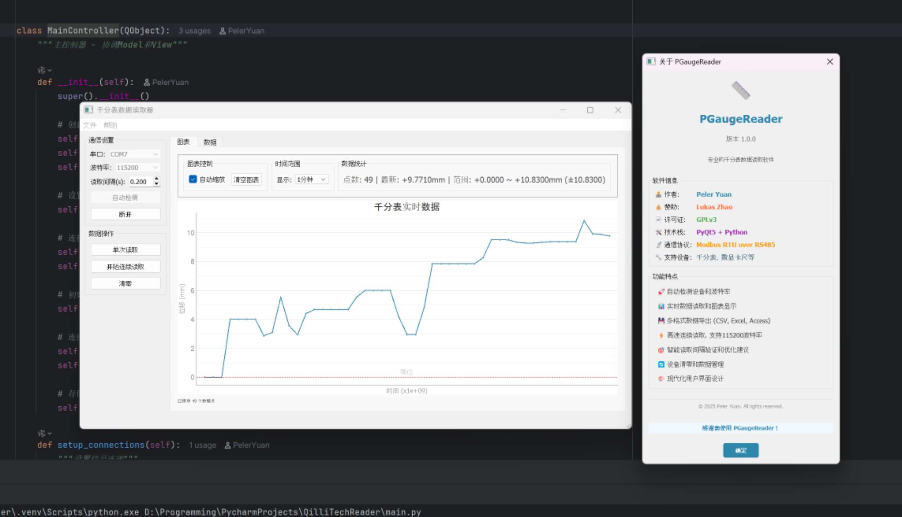
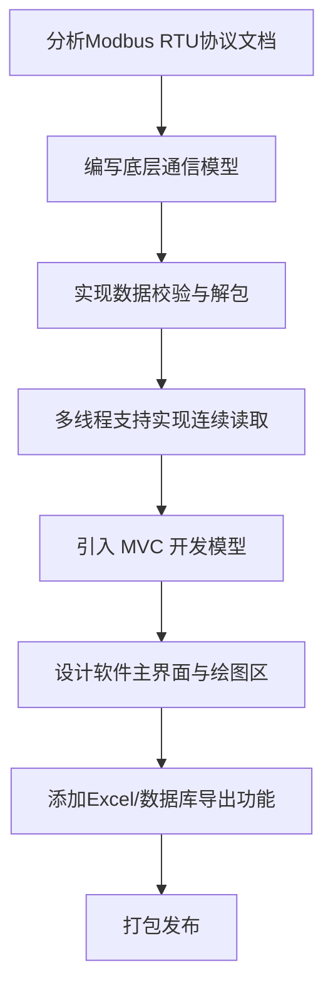

# 千分表数据实时采集与记录系统简介

## 1. 项目概述

本项目是[物理实验系统](./ExperimentSystem.md)中的一部分。

本项目旨在为实验室及工业环境下的数字式千分表提供一套完整的桌面端上位机解决方案。针对传统测量中手动记录数据效率低、易出错的问题，本项目实现了一个基于 Modbus RTU 协议的通用数据采集软件。用户无需编写任何串口通信脚本，即可通过友好的图形化界面实现设备的快速连接、波特率自动检测、单次/连续数据采集、实时波形显示以及多格式数据导出。

## 2. 项目亮点展示

本项目提供了一套现代化、高响应速度的 GUI 界面。核心亮点包括：

- **智能连接**：支持串口自动扫描与波特率自动匹配，无需手动进行复杂配置。
- **实时可视化**：集成高性能绘图组件，能够以毫秒级精度实时绘制位移变化曲线。
- **数据导出**：支持测量数据一键导出为 CSV、Excel 报表或 SQLite 数据库文件。

## 3. 项目背景

由于**物理实验系统**中需要测量样本在加工过程中产生的微小位移，因此千分表的存在是必要的。然而，采购的千分表仅提供基础的 RS-485 硬件接口，缺乏配套的上位机软件。实验人员往往需要手动抄录读数，或者使用简陋的串口调试助手查看原始十六进制数据，这不仅效率低下，且难以直观观察位移变化的趋势（如抖动、回弹等）。本项目应运而生，旨在填补这一工具空白。

## 4. 需求分析

**功能性需求：**

- **设备控制**：支持 RS-485 串口连接，支持设备置零（Zero）操作。
- **数据采集**：支持单次手动读取和自定义频率的连续自动读取。
- **可视化展示**：需提供实时滚动的位移-时间曲线图，以及列表形式的历史数据展示。
- **数据持久化**：支持将采集到的数据导出为 Excel，CSV 或 SQLite 格式。
- **易用性**：必须具备波特率自动检测功能，降低硬件配置门槛。

**非功能性需求：**

- **高响应性**：UI 界面不能在进行高频率串口通信时发生卡顿或假死（需采用多线程架构）。
- **稳定性**：能够处理串口丢包，校验错误等异常情况而不崩溃。
- **兼容性**：主要运行于 Windows 环境，需打包为独立可执行文件。

## 5. 开发流程规划

## 6. 技术栈

**硬件控制**：python + pyserial 库实现 Modbus RTU 协议串口通信。 

**桌面前端**：python + PyQt5 库实现图形化交互界面及实时波形绘制。 

**数据后端**：python + pandas/sqlite3 库实现数据统计分析及多格式导出。

## 7. 实现与技术难点

### 7.1. 硬件技术难点

**开发难点**：千分表采用 Modbus RTU 协议，需手动底层实现指令封装、CRC16 循环冗余校验及 32 位大端序数据解包。 

**工程难点**：设备波特率设置不统一且未知，需解决在无文档或配置不明情况下的设备握手与连接建立问题。

**需求难点**：高频率（>10Hz）连续采集需要精确的时序控制，必须防止指令堆积导致的总线冲突，同时需处理串口丢包等异常信号。

### 7.2. 软件技术难点

**硬件控制**：波特率自动匹配算法，最小安全读取间隔动态计算，多线程串口守护，断连检测与自动重连机制。

**桌面前端**：基于 QThread 的多线程非阻塞 UI 设计，PyQtGraph 毫秒级实时波形绘制，信号槽跨线程通信。 

**数据后端**：基于 MVC 模式的业务解耦，SQLite 轻量级存储，以及集成 Pandas 的自动化统计分析与 Excel 报表生成。

## 8. 用户界面与体验

**连接配置区**：提供端口选择（支持自动刷新）和波特率选择。包含“自动检测”按钮，一键适配设备。

**操作控制区**：包含直观的“单次读取”、“连续读取”（支持自定义间隔）、“停止”、“置零”大尺寸按钮，防止误触。

**实时波形图**：基于 PyQtGraph 定制的图表控件，支持鼠标滚轮缩放、拖拽查看历史波形，支持自动调整 Y 轴量程。

**数据列表**：实时显示采集到的“时间-数值”对，支持表头排序。

**菜单栏**：提供数据导出选项，支持 CSV、Excel 和 SQLite 数据库导出，满足不同后续处理需求。

## 9. 项目成果

目前，该软件已成功打包为 Windows 安装程序并分发。在实际实验环境中的多台电脑上稳定运行。它可以流畅地以 10Hz 以上的频率采集数据，且在长达数小时的连续测试中未出现内存泄漏或串口崩溃现象。导出的 Excel 报表直接被用于实验数据的后期分析，显著提升了工作效率。

## 10. 个人贡献

本项目除千分表采购外全部由 Peler 独立设计与开发，具体包括：

**架构设计**：设计了基于 PyQt5 的 MVC 软件架构，实现了 UI 与业务逻辑的彻底解耦。

**驱动开发**：编写 `GaugeReader` 类，实现了 Modbus RTU 协议的手动封装与 CRC 校验算法。

**核心功能**：实现了多线程连续采集算法、波特率自动检测算法以及基于 SQLite/Excel 的数据导出模块。

**界面交互**：使用 Qt Designer 设计界面，并编写了基于 PyQtGraph 的实时绘图逻辑。

**打包发布**：配置 PyInstaller spec 文件及编写 Inno Setup 脚本，构建了最终的安装包。