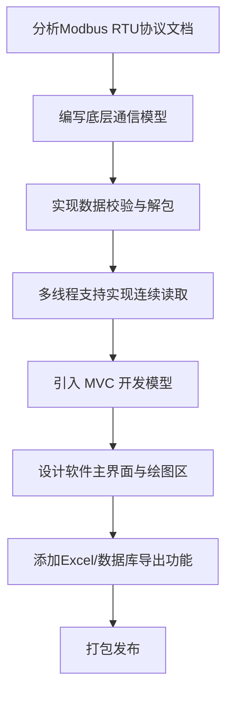

# Dial Indicator Real-Time Data Acquisition and Recording System Overview

## 1. Project Overview

This project is part of the [Physical Experiment System](./ExperimentSystem_en.md).

This project aims to provide a complete desktop host software solution for digital dial indicators used in laboratory and industrial environments. Targeting the inefficiency and error-proneness of manual data recording in traditional measurement workflows, this project implements a general-purpose data acquisition software based on the Modbus RTU protocol. Without writing any serial communication scripts, users can quickly connect devices, auto-detect baud rates, perform single or continuous data acquisition, view real-time waveforms, and export data in multiple formats — all through a friendly graphical interface.

## 2. Project Highlights

This project delivers a modern, high-responsiveness GUI. Key highlights include:

- **Smart connection**: Supports automatic serial port scanning and baud rate matching, eliminating the need for manual complex configuration.
- **Real-time visualization**: Integrated high-performance plotting component capable of rendering displacement curves in real time with millisecond-level precision.
- **Data export**: Supports one-click export of measurement data to CSV, Excel reports, or SQLite database files.

## 3. Project Background

The **Physical Experiment System** requires measuring the minute displacements produced by samples during processing, making a dial indicator necessary. However, the procured dial indicator only provides a basic RS-485 hardware interface with no accompanying host software. Experimenters were forced to manually transcribe readings or use a rudimentary serial debug assistant to view raw hexadecimal data — an approach that is not only inefficient but also makes it difficult to visually observe displacement trends (such as vibration or rebound). This project was created to fill that tooling gap.

## 4. Requirements Analysis

**Functional requirements:**

- **Device control**: RS-485 serial connection support, and device zero (Zero) operation.
- **Data acquisition**: Single manual reading and continuous automatic reading at a user-defined frequency.
- **Visualization**: Real-time scrolling displacement-time curve chart, and historical data display in list form.
- **Data persistence**: Export of acquired data to Excel, CSV, or SQLite format.
- **Ease of use**: Automatic baud rate detection to lower the hardware configuration barrier.

**Non-functional requirements:**

- **High responsiveness**: The UI must not freeze or become unresponsive during high-frequency serial communication (requires a multi-threaded architecture).
- **Stability**: Must handle serial packet loss, checksum errors, and other anomalies without crashing.
- **Compatibility**: Primarily runs on Windows; must be packaged as a standalone executable.

## 5. Development Workflow

## 6. Technology Stack

**Hardware control**: Python + pyserial library for Modbus RTU protocol serial communication.

**Desktop frontend**: Python + PyQt5 library for the graphical interactive interface and real-time waveform rendering.

**Data backend**: Python + pandas/sqlite3 libraries for data statistical analysis and multi-format export.

## 7. Implementation and Technical Challenges

### 7.1. Hardware Challenges

**Development challenges**: The dial indicator uses the Modbus RTU protocol, requiring manual low-level implementation of command framing, CRC16 cyclic redundancy check, and 32-bit big-endian data unpacking.

**Engineering challenges**: Device baud rate settings are inconsistent and unknown, requiring a solution for device handshaking and connection establishment without documentation or known configuration.

**Requirements challenges**: High-frequency (>10 Hz) continuous acquisition requires precise timing control; bus conflicts caused by command queuing must be prevented, and serial packet loss and other abnormal signals must be handled.

### 7.2. Software Challenges

**Hardware control**: Baud rate auto-matching algorithm, dynamic calculation of minimum safe read interval, multi-threaded serial port watchdog, and disconnection detection with automatic reconnection.

**Desktop frontend**: QThread-based multi-threaded non-blocking UI design, PyQtGraph millisecond-level real-time waveform rendering, and signal-slot cross-thread communication.

**Data backend**: Business logic decoupling based on the MVC pattern, SQLite lightweight storage, and automated statistical analysis and Excel report generation integrated with Pandas.

## 8. User Interface and Experience

**Connection configuration panel**: Provides port selection (with auto-refresh) and baud rate selection. Includes an "Auto Detect" button for one-click device adaptation.

**Operation control panel**: Contains large, clearly labeled buttons — "Single Read", "Continuous Read" (with customizable interval), "Stop", and "Zero" — sized to prevent accidental taps.

**Real-time waveform chart**: A custom chart widget based on PyQtGraph, supporting mouse-wheel zoom, drag to view historical waveforms, and automatic Y-axis range adjustment.

**Data list**: Displays acquired time-value pairs in real time, with sortable column headers.

**Menu bar**: Provides data export options supporting CSV, Excel, and SQLite database export to meet different downstream processing needs.

## 9. Project Outcomes

To date, the software has been successfully packaged as a Windows installer and distributed. It runs stably on multiple computers in the actual experimental environment. It can smoothly acquire data at frequencies above 10 Hz, and no memory leaks or serial port crashes have occurred during continuous testing lasting several hours. The exported Excel reports are directly used for post-experiment data analysis, significantly improving workflow efficiency.

## 10. Personal Contributions

This project was independently designed and developed entirely by Peler except for the dial indicator procurement, including:

**Architecture design**: Designed a PyQt5-based MVC software architecture, achieving complete decoupling of UI and business logic.

**Driver development**: Wrote the `GaugeReader` class, implementing manual Modbus RTU protocol framing and the CRC checksum algorithm.

**Core features**: Implemented the multi-threaded continuous acquisition algorithm, baud rate auto-detection algorithm, and SQLite/Excel-based data export module.

**UI interaction**: Designed the interface using Qt Designer and wrote the real-time plotting logic based on PyQtGraph.

**Packaging and release**: Configured the PyInstaller spec file and wrote the Inno Setup script to build the final installer package.
