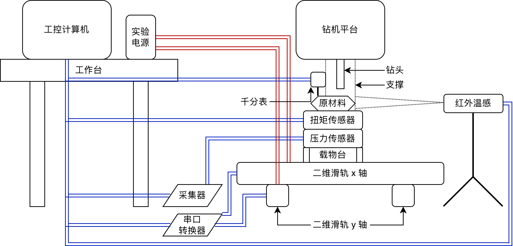
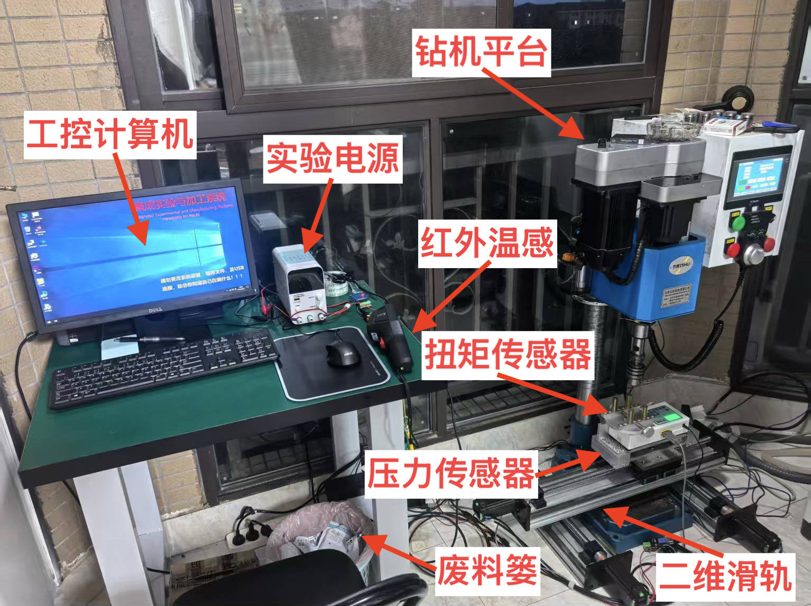
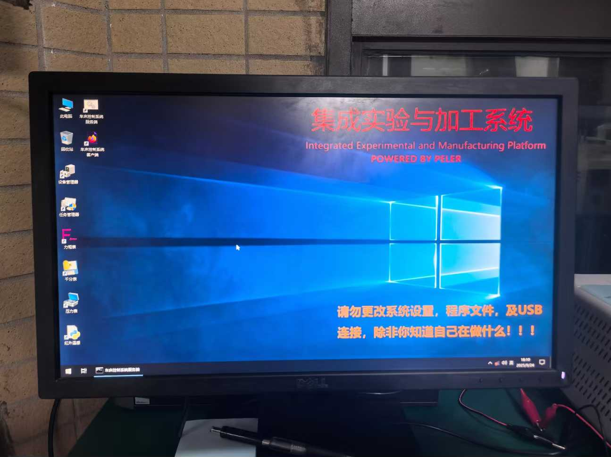
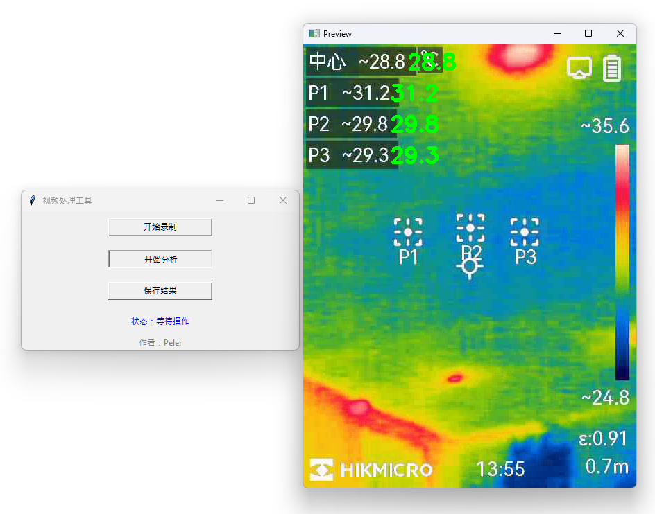
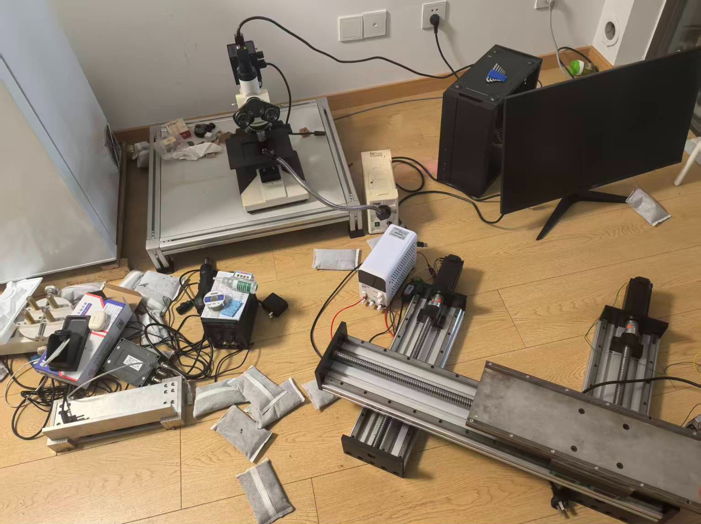
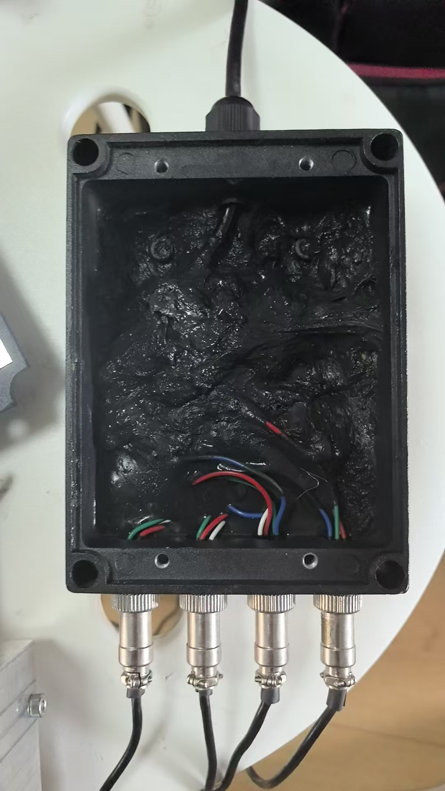
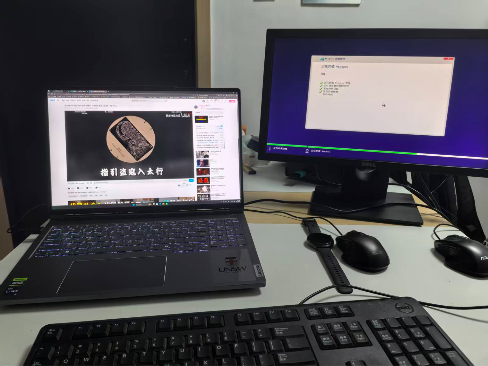
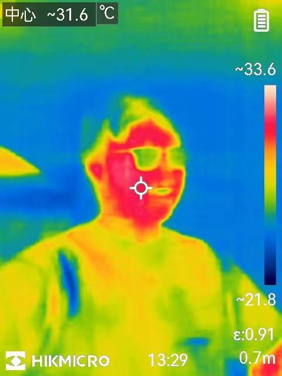

# 物理实验系统简介

## 1. 项目概述

本项目旨在构建一套集实验样本加工和数值记录于一体的实验系统，满足物理老师 Lukas 博士课题的需要。项目包含工控计算机，钻机平台，二维滑轨，压力传感器，扭矩传感器，红外温感和千分表，主要用于记录以不同方式加工木材时产生的压力，扭矩，温度和形变。整体项目除部分硬件采购之外全部由且仅由 Peler 完成，目前整体项目已稳定运行超四个月，支持数十场实验样本加工和数据记录。

## 2. 项目亮点展示

**集成性**：所有部件连接到工控计算机进行统一操控与协作，一站式解决实验样本加工与数据采集。

**易用性**：所有功能提供开箱即用的图形化用户界面（包含图形化滑轨编程系统），配合用户手册最大程度降低学习成本。

**低成本**：系统中多数部件采用二手，虽因缺乏资料等因素增加项目开发难度，但大大节约了成本。

**可维护性**：系统各个模块标注清晰，接线方式，常见问题等开发记录详尽，可供技术人员快速检修与维护。

**稳定性**：系统已稳定运行四个多月，成功承受高振动高灰尘环境，支持数十场实验顺利进行。

## 3. 项目背景

在 Lukas 的博士课题中，需要研究不同木材加工方式对木材整体结构稳定性的影响。因此，一套木材集成加工和数据记录系统是必不可少的。钻机平台和配套的二维滑轨系统支持了对木材打孔方位的精确控制，加装在滑轨置物台上的压力传感器和扭矩传感器提供了实时的数据记录功能，以便后续的数学分析。此外，红外温感和千分表也可以在必要时采集相应数据，提供红外热图分析和实时位移数据记录。由于实验的独创性，目前市面上并没有成熟的系统解决方案。同时，因预算受限，多数实验器材使用二手产品，面临文档缺失，无技术支持等挑战。如何将实验系统的各个部分成功驱动，并最终集成为一个工控系统，实现钻机平台和二维滑轨的协作，传感器数据实时汇总采集成为本项目需要攻克的难关。

## 4. 需求分析

### 工控计算机

- **软件需求**：稳定的 Windows10 发行版。
- **硬件需求**：不少于 4GB 的内存用于同时运行多种实验软件，较为现代的 CPU 主要用于应对红外热图分析的压力。

### 钻机平台

- **软件需求**：无，提供内置工控系统，但需要测量并计算每次的加工数据。
- **硬件需求**：需要调整钻头高度，为二维滑轨留下足够空间。

### 二维滑轨

- **软件需求**：通过USB 串口转换器分时控制不同电机，实现电机的同步运行和精确移动，并将相应功能封装为 API。
- **硬件需求**：确保接线和整体滑轨系统的稳固，需要承受住搬运和钻机平台产生的长时间高强度振动和大量灰尘。
- **用户需求**：设计一款易于上手的图形化用户界面，使非技术人员能够快速掌握对滑轨编程控制。

### 压力传感器

- **软件需求**：厂家提供硬件采集器和上位机软件，但是厂家技术支持难以寻找，设备型号与实际情况不符。
- **硬件需求**：4个压力传感器及厂家配套的采集器，但接线混乱无法使用，无法寻找到相关文档。
- **用户需求**：提供直接可以使用的上位机软件，进行数据的实时传输显示和记录。

### 扭矩传感器

- **软件需求**：厂家提供上位机软件，但是厂家技术支持难以寻找。
- **硬件需求**：需要分配一个 220V 电源进行供电，除此之外使用 USB 直连电脑，无需额外配置。
- **用户需求**：提供直接可以使用的上位机软件，进行数据的实时传输显示和记录。

### 红外温感

- **软件需求**：设备内置局域网传输功能，但因为是二手产品导致管理员密码丢失而不可用，需要找到其他的方法进行数据传输。
- **硬件需求**：由于无法使用局域网连接，需要使用 USB-TypeC 数据线，考虑到实际场景，数据线长度需要足够。
- **用户需求**：提供直接可以使用的上位机软件，进行红外热图的实时传输和记录，并支持对特定点的温度数据分析。

### 千分表

- **软件需求**：厂家提供明确文档和收费软件，出于预算原因需要自己开发。
- **硬件需求**：需要配备额外的 USB 串口转换器连接厂家提供的解码器与千分表。
- **用户需求**：提供直接可以使用的上位机软件，进行数据的实时传输显示，尤其需要高频率读取和对应时间戳记录以便后期整合数据。

## 5. 项目各部分构成

**二维示意图**：

**实物图**：

由于拍摄时还处于开发和调试阶段，钻机平台上方仍有杂物未清除。千分表由于使用场景不同并未出现在图中，请见**项目展示**章节。

## 6. 项目展示

因涉及版权问题，本章节仅展示由 Peler 自主开发的软件或硬件连接方式。

### 工控计算机系统

完备的集成实验与加工系统。包含全部的上位机软件和所需的数据分析软件，并创建常见系统管理工具的快捷方式。系统层面采用 Windows 10 Enterprise 2021 LTSC，结合脚本进行深度优化，停止系统更新等服务，确保系统稳定且不会变动。详见：[工控计算机系统](./IndustrialControlComputerSystem.md)。

### 二维滑轨模块化编程控制系统

零成本上手的模块化编程系统。支持控制台输出，循环语句，条件语句，变量和函数，以及对滑轨进行初始化，归位，精确移动，设置速度移动等操作。详见：[二维滑轨模块化编程控制系统](./SlidewayControlSystem.md)。

### 红外热图实时传输与分析系统

精简易用的红外温感软件。支持从设备实时传输并录制红外热图视频，分析视频，获取每一帧中心点与3个用户自定义点位的温度值，并支持视频和分析结果的保存。详见：[红外热图实时传输与分析系统](./ThermalImageAnalysisSystem.md)。

### 千分表数据实时采集与记录系统

强大的千分表数据读取软件，包含实验所需的全部功能。支持自动检测并比配波特率，动态读取数据并实时在图表中显示，以及数据导出。详见：[千分表数据实时采集与记录系统](./DialIndicatorSystem.md)。

## 7. 整体实现与设计难点

**设计难点**：整体系统包含部件多，但场地大小受限。如何安排有限的空间保证系统稳定性，安全性和易用性成为一大挑战。

**工程难点**：场地大小受限，二维滑轨，钻机和工作台等大体积物件搬运组装困难。钻机平台需要特殊大功率插座供电以及额外接地。

**需求难点**：在保证系统整体紧凑性的同时确保其可维护性，整体系统需要承受钻机平台带来的高振动，高灰尘环境长期稳定运行。

**维护难点**：部分部件（如压力传感器，二维滑轨）接线复杂，需要对线缆及连接方式进行标注以供后期检修。

**软件难点**：确保系统及各个软件的稳定性与兼容性，调试各个设备，对固定参数进行提前配置，尽可能降低用户学习成本。

## 8. 项目成果

目前，本项目已正式部署并投入实验环境长达四个多月，稳定运行并支持数十次实验样本制造与相应数据的记录。根据上一次的检修结果，本系统在长达三个月的使用中并未出现任何问题或潜在隐患，所有部件运行良好，承受住了高振动和高灰尘的环境。

## 9. 个人贡献

**采购部件**：工控计算机系统，工作台，实验电源，线缆及所需的 USB 串口转换器。

**软件开发**：整体工控计算机系统，二维滑轨模块化编程控制系统，红外热图实时传输与分析系统，千分表数据实时采集与记录系统。

**安装并测试**：工作台，工控计算机系统，扭矩传感器，压力传感器，二维滑轨，红外温感，千分表。

**其余杂项**：系统整体布局的设计与安装，系统定期检修维护，编写开发文档及使用手册。

## 10. 开发相册

一开始总是一团糟的$#&

这个硬件看起来并不是开源的……

忙里偷闲，安装系统的时候听点音乐吧

眼睛还是墨镜？

三个月稳定运行达成！

