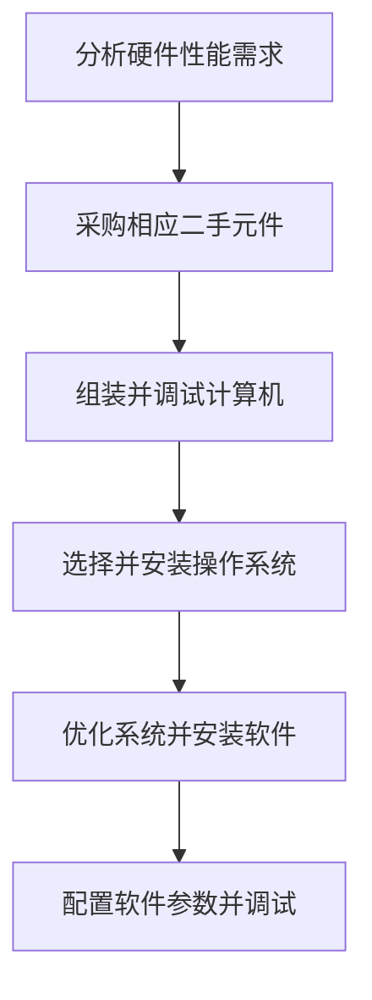

# 工控计算机系统简介

## 1. 项目概述

本项目是[物理实验系统](./ExperimentSystem.md)中的一部分。

本项目旨在为实验人员提供一套系统的软硬件解决方案，连接并控制物理实验系统中所有的硬件，使其可以一站式的对实验设备进行操控与监控，进行数据的采集与分析。

## 2. 项目背景

在**物理实验系统**设计之初，并未考虑增加一台工控计算机将所有硬件设备进行统一的管理，而是每回在实验时临时使用笔记本电脑连接所需设备。但是，此方案并未考虑到实际使用过程中笔记本电脑无处摆放，硬件连接与软件配置繁琐复杂，实验记录书写困难等问题。因此，后续的设计方案中包含了工控计算机，提供稳定，无需更改与重复配置的硬件配置。同时，工作台的设计也为实验记录的书写和工具的临时摆放提供了平台。

## 3. 需求分析

**功能性需求**：足够的硬件性能以同时运行多实验软件，足够的 USB 接口用于连接各种硬件。

**非功能性需求**：确保机箱大小合适，节约预算，考虑散热等系统稳定性问题确保 7*24 小时全天候运行。

## 4. 开发流程规划

## 5. 技术栈

**系统激活**：使用 [Microsoft Activation Scripts (MAS)](https://github.com/massgravel/Microsoft-Activation-Scripts) 工具。

**系统优化**：使用 [Chris Titus Tech's WinUtil](https://github.com/ChrisTitusTech/winutil) 调教优化系统，关闭非必要服务并暂停系统更新。

## 6. 实现与技术难点

**开发难点**：由于预算原因，全部采用廉价二手硬件，需要确保硬件使用寿命与兼容性。

**工程难点**：采购合适二手硬件难度大，需要综合考虑价格与性能并辨别真伪。

**需求难点**：机箱为隔绝高灰尘环境需要放置在工作台上，因此需要严格限制大小。

**软件难点**：部分二手实验设备缺乏文档与软件使用手册，需要完全凭借经验对出现的各种报错进行处理。

## 7. 项目成果

目前，本系统已在实际的实验环境中稳定运行四个多月，支持数十次实验样本制造。在上一次的检修中证实经过三个月的高振动高灰尘环境后整体系统功能全部正常。用户反馈相较于原先的设计易用性显著提高，数据收集和记录便捷，实验环境更加有序。

## 8. 个人贡献

本项目全部由 Peler 完成，具体包括：

**硬件**：采购，组装，调试计算机硬件。

**软件**：获取，安装，配置软件，安装并优化操作系统。

**综合**：规划工作台台面布局，放置工控计算机并配置显示器与键鼠。
