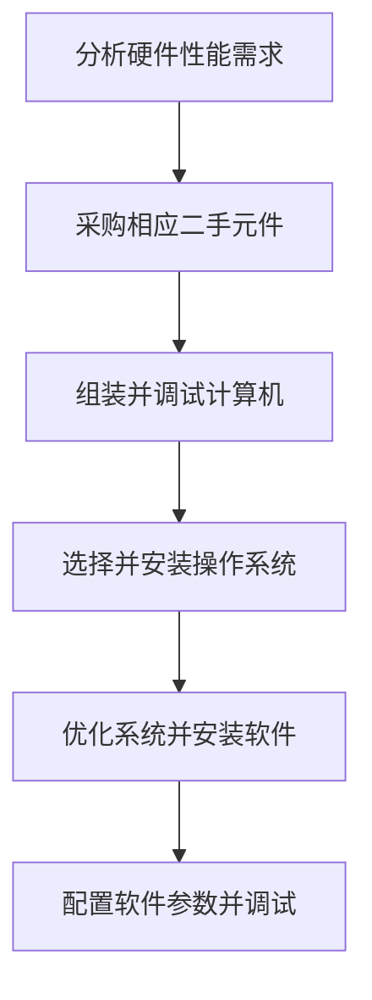

# Industrial Control Computer System Overview

## 1. Project Overview

This project is part of the [Physical Experiment System](./ExperimentSystem_en.md).

This project aims to provide experimenters with a comprehensive hardware and software solution that connects and controls all hardware in the physical experiment system, enabling one-stop operation, monitoring, data acquisition, and analysis of experimental equipment.

## 2. Project Background

In the initial design of the **Physical Experiment System**, no industrial control computer was planned to centrally manage all hardware devices. Instead, a laptop was temporarily connected to the required devices before each experiment. However, this approach failed to account for practical issues such as the lack of a suitable place to put the laptop, the complexity of hardware connections and software configuration, and the difficulty of writing experimental records. Consequently, the subsequent design incorporated an industrial control computer to provide a stable hardware configuration that requires no repeated changes or reconfiguration. The workbench design also provides a platform for writing experimental records and temporarily placing tools.

## 3. Requirements Analysis

**Functional requirements**: Sufficient hardware performance to run multiple experiment software simultaneously, and enough USB ports to connect various hardware devices.

**Non-functional requirements**: Ensure the chassis is appropriately sized, stay within budget, and address thermal management and other system stability concerns to ensure 24/7 continuous operation.

## 4. Development Workflow

## 5. Technology Stack

**System activation**: [Microsoft Activation Scripts (MAS)](https://github.com/massgravel/Microsoft-Activation-Scripts).

**System optimization**: [Chris Titus Tech's WinUtil](https://github.com/ChrisTitusTech/winutil) — used to tune and optimize the system, disable non-essential services, and pause system updates.

## 6. Implementation and Technical Challenges

**Development challenges**: All hardware is low-cost and second-hand due to budget constraints; ensuring hardware longevity and compatibility is critical.

**Engineering challenges**: Sourcing suitable second-hand hardware is difficult, requiring careful evaluation of price-to-performance ratio and authenticity verification.

**Requirements challenges**: The chassis must be placed on the workbench to isolate it from the high-dust environment, imposing strict size constraints.

**Software challenges**: Some second-hand experimental devices lack documentation and software manuals, requiring issues to be resolved entirely through experience.

## 7. Project Outcomes

To date, the system has been in stable operation in the actual experimental environment for over four months, supporting dozens of experimental sample fabrication sessions. The most recent inspection confirmed that after three months of exposure to high-vibration and high-dust conditions, all system functions remain fully operational. User feedback indicates a significant improvement in usability compared to the original design, with more convenient data collection and recording and a more organized experimental environment.

## 8. Personal Contributions

This project was completed entirely by Peler, including:

**Hardware**: Procurement, assembly, and debugging of computer hardware.

**Software**: Acquisition, installation, and configuration of software; installation and optimization of the operating system.

**General**: Planning the workbench layout, placing the industrial control computer, and configuring the monitor, keyboard, and mouse.
