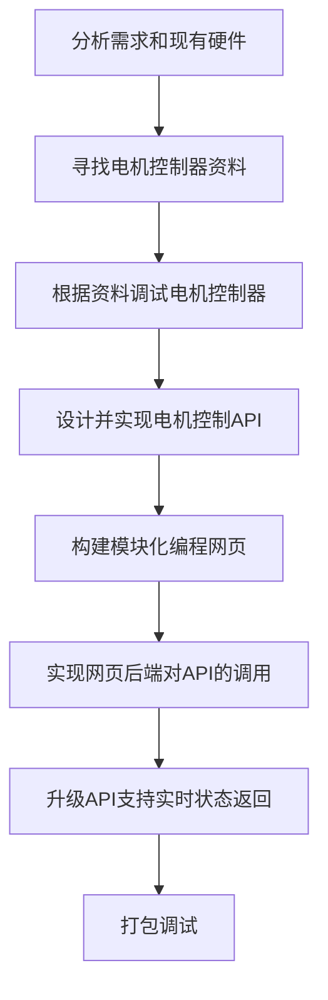

# 二维滑轨模块化编程控制系统简介

## 1. 项目概述

本项目是[物理实验系统](./ExperimentSystem.md)中的一部分。

本项目旨在为普通用户提供一套模块化的网页编程系统，大大降低滑轨编程的难度，使其可以在实际开发中快速便捷的操作滑轨进行初始化，归位，精确移动，设置速度移动等操作。

## 2. 项目亮点展示

本项目提供了一整套系统的图形化编程环境，包含模块化编程区域，自动代码生成区（供高级用户调试和检查），以及运行结果区。提供滑轨状态实时监控和代码调试功能，同时支持项目的保存和导入。

## 3. 项目背景

由于**物理实验系统**需要使用钻机平台加工木材，实现诸如精确间距钻孔等操作。因此，一套可以精确移动的二维滑轨系统是必不可少的。如何提供一套易于上手的用户控制界面供无任何技术背景的用户使用成为一大挑战。本项目在此需求下催生并成功解决了此需求。

## 4. 需求分析

**功能性需求**：滑轨精确移动控制，完整的模块化编程功能，代码转译显示界面，系统状态实时显示，项目的导出和导入。

**非功能性需求**：与电机控制器通讯过程中的抗干扰问题，滑轨电机限位保护方案，整体系统需要长期承受高振动高灰尘环境。

## 5. 开发流程规划

## 6. 技术栈

**硬件控制**：python + pyserial 库实现串口通信。

**网页前端**：原生 javascript + blocky 库实现模块化编程界面。

**网页后端**：python + flask 提供网页和硬件控制的API接口。

## 7. 实现与技术难点

### 7.1. 硬件技术难点

**开发难点**：采用二手产品导致的电机控制器型号模糊，相关文档缺少。

**工程难点**：整体滑轨系统重量大，接线等安装步骤困难。

**需求难点**：高比特率通信需要解决信号干扰问题，整体系统需要高稳固性，必须经受搬运的颠簸和后续钻机平台带来的持续振动和灰尘。

### 7.2. 软件技术难点

**硬件控制**：电机指令同步，电机坐标校准，电机分时控制，串口丢包处理，电机限位保护重启。

**网页前端**：模块化编程界面设计，自定义代码块逻辑。

**系统后端**：用户编写程序对电机控制API的调用，实时状态监控。

## 8. 用户界面与体验

1. 代码块菜单栏，提供基础的逻辑，循环，数学运算，字符串运算，变量，函数以及滑轨控制功能。
2. 模块化编程区域，用户通过从菜单栏中拖拽模块进行组合排列进行编程。
3. 菜单栏，包含项目导出导入功能和运行按钮。
4. 生成代码区，实时显示根据用户模块化编程生成的代码，供高级用户调试和检查。
5. 运行结果区，根据程序运行结果实时返回运行信息及滑轨状态。

## 9. 项目成果

目前，本项目已在实际的实验环境中稳定运行四个多月，支持数十次实验样本制造。在上一次的检修中证实经过三个月的高振动高灰尘环境后整体系统功能全部正常。用户反馈模块化编程界面直观简洁，涵盖所有功能需求。

## 10. 个人贡献

本项目除滑轨采购外全部由 Peler 完成，具体包括：

**硬件**：接线，加固滑轨，添加USB串口转换器，调试电机控制器。

**软件**：底层电机控制API，模块化编程前端，网页后端。

**综合**：寻找文档并调试电机控制器，开发并测试系统，编写文档。

***除此之外，Hank 帮助了系统的接线与搬运，为系统的硬件开发节省了很多时间和力气。***