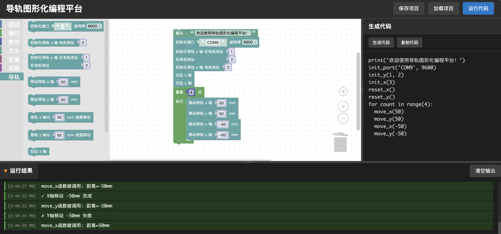
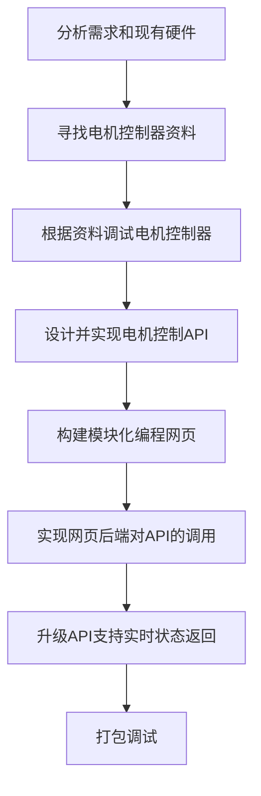
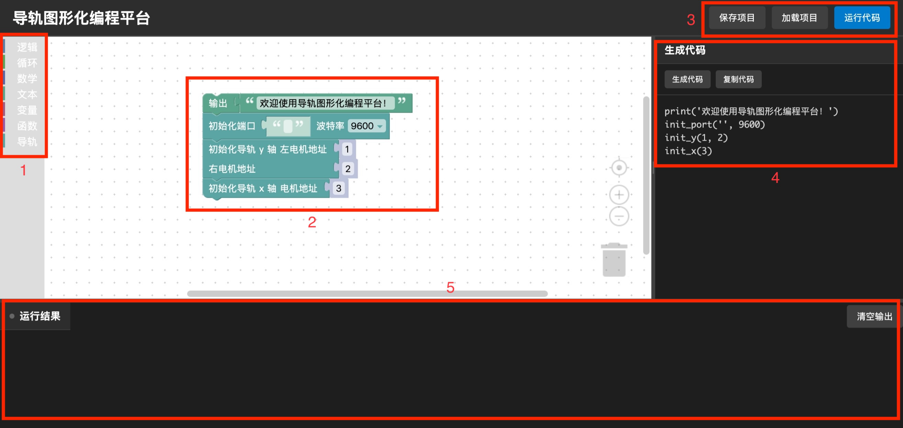

# 2D Slideway Modular Programming Control System Overview

## 1. Project Overview

This project is part of the [Physical Experiment System](./ExperimentSystem_en.md).

This project aims to provide general users with a modular web-based programming system that greatly reduces the complexity of slideway programming, enabling users to quickly and conveniently perform slideway operations — including initialization, homing, precise movement, and speed-based movement — in actual experimental workflows.

## 2. Project Highlights

This project provides a complete graphical programming environment, including a modular programming area, an auto-generated code panel (for advanced users to debug and inspect), and a run output area. It offers real-time slideway status monitoring and code debugging capabilities, along with project save and import support.

## 3. Project Background

The **Physical Experiment System** requires the drilling platform to process wood, performing operations such as drilling holes at precise intervals. Therefore, a 2D slideway system capable of precise movement is essential. Providing an intuitive user control interface for users with no technical background became a major challenge. This project was born out of that requirement and successfully addressed it.

## 4. Requirements Analysis

**Functional requirements**: Precise slideway movement control, full modular programming functionality, code transpilation display panel, real-time system status display, and project export/import.

**Non-functional requirements**: Anti-interference measures during communication with the motor controller, slideway motor limit protection scheme, and long-term resilience of the overall system to high-vibration and high-dust environments.

## 5. Development Workflow

## 6. Technology Stack

**Hardware control**: Python + pyserial library for serial communication.

**Web frontend**: Vanilla JavaScript + Blockly library for the modular programming interface.

**Web backend**: Python + Flask to provide the web interface and hardware control API endpoints.

## 7. Implementation and Technical Challenges

### 7.1. Hardware Challenges

**Development challenges**: Use of second-hand products resulted in ambiguous motor controller model numbers and missing documentation.

**Engineering challenges**: The overall slideway system is heavy, making wiring and other installation steps difficult.

**Requirements challenges**: High baud-rate communication requires resolving signal interference issues; the overall system must be highly robust, capable of withstanding the jolts of transportation and the sustained vibration and dust generated by the drilling platform.

### 7.2. Software Challenges

**Hardware control**: Motor command synchronization, motor coordinate calibration, time-division motor control, serial packet loss handling, and motor limit protection restart.

**Web frontend**: Modular programming interface design and custom code block logic.

**System backend**: Calling the motor control API from user-written programs, and real-time status monitoring.

## 8. User Interface and Experience

1. Code block menu bar — provides basic logic, loops, math operations, string operations, variables, functions, and slideway control blocks.
2. Modular programming area — users program by dragging and combining blocks from the menu bar.
3. Menu bar — includes project export/import functions and the run button.
4. Generated code panel — displays in real time the code generated from the user's modular program, for advanced users to debug and inspect.
5. Run output area — returns real-time run information and slideway status based on program execution results.

## 9. Project Outcomes

To date, this project has been in stable operation in the actual experimental environment for over four months, supporting dozens of experimental sample fabrication sessions. The most recent inspection confirmed that after three months of high-vibration and high-dust conditions, all system functions remain fully operational. User feedback indicates that the modular programming interface is intuitive and concise, covering all functional requirements.

## 10. Personal Contributions

This project was completed entirely by Peler except for the slideway procurement, including:

**Hardware**: Wiring, reinforcing the slideway, adding USB-to-serial converters, and debugging the motor controller.

**Software**: Low-level motor control API, modular programming frontend, and web backend.

**General**: Locating documentation and debugging the motor controller, developing and testing the system, and writing documentation.

***In addition, Hank assisted with wiring and transportation, saving considerable time and effort on the hardware development side.***
