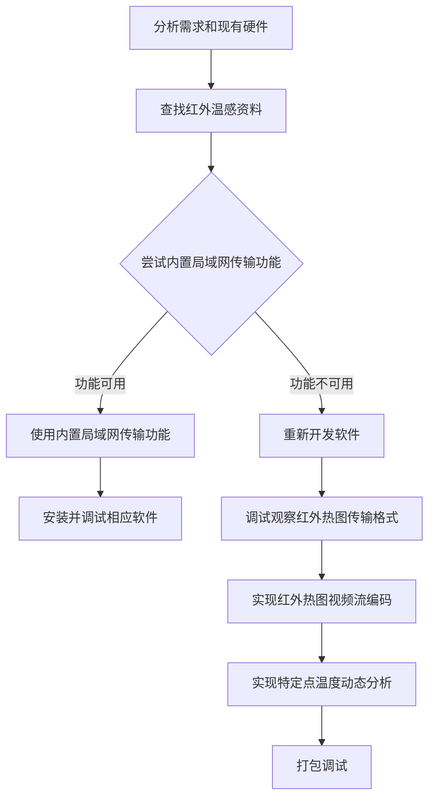

# 红外热图实时传输与分析系统简介

## 1. 项目概述

本项目是[物理实验系统](./ExperimentSystem.md)中的一部分。

本项目旨在为用户提供一套简易的红外温感配套软件，支持红外热图的实时传输与记录，以及热图特定点温度的可视化分析与数据导出，使其可以在实验中便捷的使用红外温感装置采集温度数据，为后续的理论分析提供支持。

## 2. 项目亮点展示

本项目定义并提供了一套极度简化工作流，以最简便的界面实现对红外热图的采集，分析与导出。用户无需任何学习成本便可以一目了然的使用软件进行所需的全部操作。

## 3. 项目背景

由于**物理实验系统**需要记录特定加工过程中原材料特定点温度的变化情况。因此，一套可传输和记录红外热图的系统是必不可少的。红外温感内置局域网传输功能，但由于是二手产品导致管理员密码丢失而不可用，只能转而使用USB-TypeC 数据线进行红外热图的传输。如何将实施传输的红外热图保存并编码为可用的视频格式，如何从红外热图画面中读取特定点温度数据成为一大挑战。本项目在此需求下催生并成功解决了此需求。

## 4. 需求分析

**功能性需求**：红外热图实时传输与显示，红外热图视频流编码与保存，红外热图特定点数据分析，分析数据与视频导出。

**非功能性需求**：软件整体需要最大程度的减少硬件的配置难度，做到即插即用，同时确保用户界面简洁。

## 5. 开发流程规划

## 6. 技术栈

**视频流编码**：多线程调用 FFmpeg 工具流式采集并编码为 H.264 格式。

**红外热图分析**：OpenCV + Pillow 库截取图像区域，集成 ddddocr 库识别温度数值。

**图形化用户界面**：Python 原生 Tkinter 标准库构建桌面控制窗口与交互逻辑。

## 7. 实现与技术难点

**开发难点**：采用二手产品导致红外温感型号模糊，相关文档缺少。

**需求难点**：额外编写软件实时读取红外热图的方案无任何技术支持和项目可供参考，完全依靠经验摸索。

**工程难点**：确保复杂多变环境中红外热图分析的正确率，以及优化性能占用，处理红外温感断链等突发问题。

## 8. 项目成果

目前，本项目已在实际的实验环境中稳定运行四个多月，支持数十次实验样本制造。在上一次的检修中证实经过三个月的高振动高灰尘环境后整体系统功能全部正常。用户反馈模块化编程界面直观简洁，涵盖所有功能需求。

## 9. 个人贡献

本项目除红外温感采购外全部由 Peler 完成，具体包括：

**硬件**：不断试错探索红外温感使用，配置参数。

**软件**：视频流传输与编码，红外热图分析与数据导出。

**综合**：开发并测试软件，编写文档。
