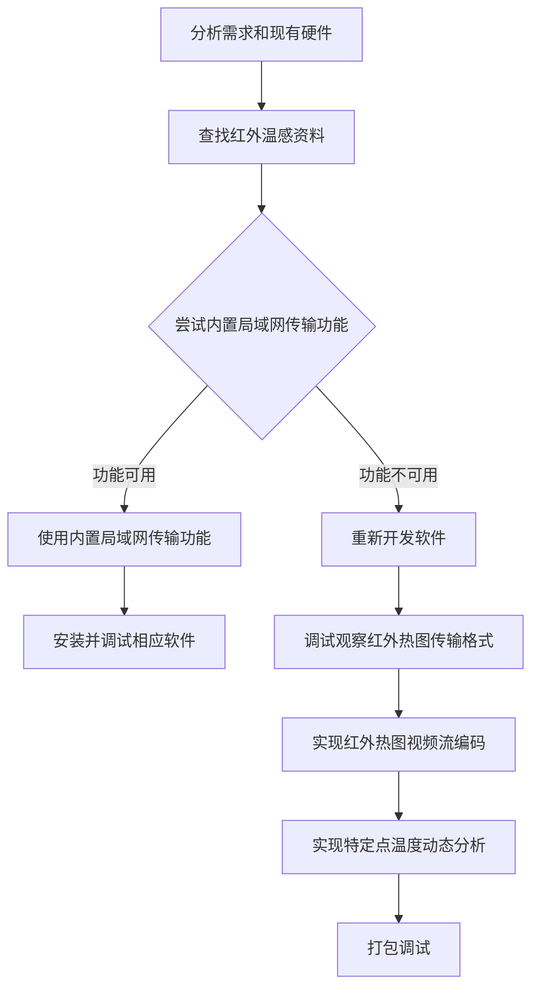

# Infrared Thermal Image Real-Time Transfer and Analysis System Overview

## 1. Project Overview

This project is part of the [Physical Experiment System](./ExperimentSystem_en.md).

This project aims to provide users with a simple companion software for the infrared thermal imager, supporting real-time transfer and recording of infrared thermal images, as well as visualization analysis and data export of temperature at specific points in the thermal image. It enables convenient use of the infrared thermal imager during experiments to collect temperature data and support subsequent theoretical analysis.

## 2. Project Highlights

This project defines and delivers an extremely streamlined workflow, implementing acquisition, analysis, and export of infrared thermal images through the simplest possible interface. Users can intuitively perform all required operations with zero learning curve.

## 3. Project Background

The **Physical Experiment System** requires recording temperature changes at specific points on raw materials during certain processing operations. Therefore, a system capable of transferring and recording infrared thermal images is essential. The infrared thermal imager has a built-in LAN transfer function, but it is unavailable due to a lost administrator password (second-hand unit), necessitating the use of a USB-C cable for thermal image transfer. How to save and encode the real-time infrared thermal images into a usable video format, and how to read temperature data at specific points from the thermal image frames, became major challenges. This project was born out of those requirements and successfully addressed them.

## 4. Requirements Analysis

**Functional requirements**: Real-time infrared thermal image transfer and display, infrared thermal video stream encoding and saving, temperature data analysis at specific points in thermal images, and export of analysis data and video.

**Non-functional requirements**: The software must minimize hardware configuration complexity to the greatest extent possible, achieving plug-and-play operation, while keeping the user interface clean and simple.

## 5. Development Workflow

## 6. Technology Stack

**Video stream encoding**: Multi-threaded FFmpeg invocation for streaming capture and encoding to H.264 format.

**Infrared thermal image analysis**: OpenCV + Pillow for image region cropping, integrated with ddddocr for temperature value recognition.

**Graphical user interface**: Python's native Tkinter standard library for building the desktop control window and interaction logic.

## 7. Implementation and Technical Challenges

**Development challenges**: Use of a second-hand product resulted in an ambiguous infrared thermal imager model and missing documentation.

**Requirements challenges**: The approach of writing additional software to read infrared thermal images in real time had no technical support or reference projects available; it was developed entirely through trial and error.

**Engineering challenges**: Ensuring the accuracy of infrared thermal image analysis in complex and variable environments, optimizing performance overhead, and handling unexpected issues such as device disconnection.

## 8. Project Outcomes

To date, this project has been in stable operation in the actual experimental environment for over four months, supporting dozens of experimental sample fabrication sessions. The most recent inspection confirmed that after three months of high-vibration and high-dust conditions, all system functions remain fully operational. User feedback indicates that the interface is intuitive and concise, covering all functional requirements.

## 9. Personal Contributions

This project was completed entirely by Peler except for the infrared thermal imager procurement, including:

**Hardware**: Iterative trial and error to explore the use of the infrared thermal imager and configure its parameters.

**Software**: Video stream transfer and encoding, infrared thermal image analysis and data export.

**General**: Developing and testing the software, and writing documentation.
