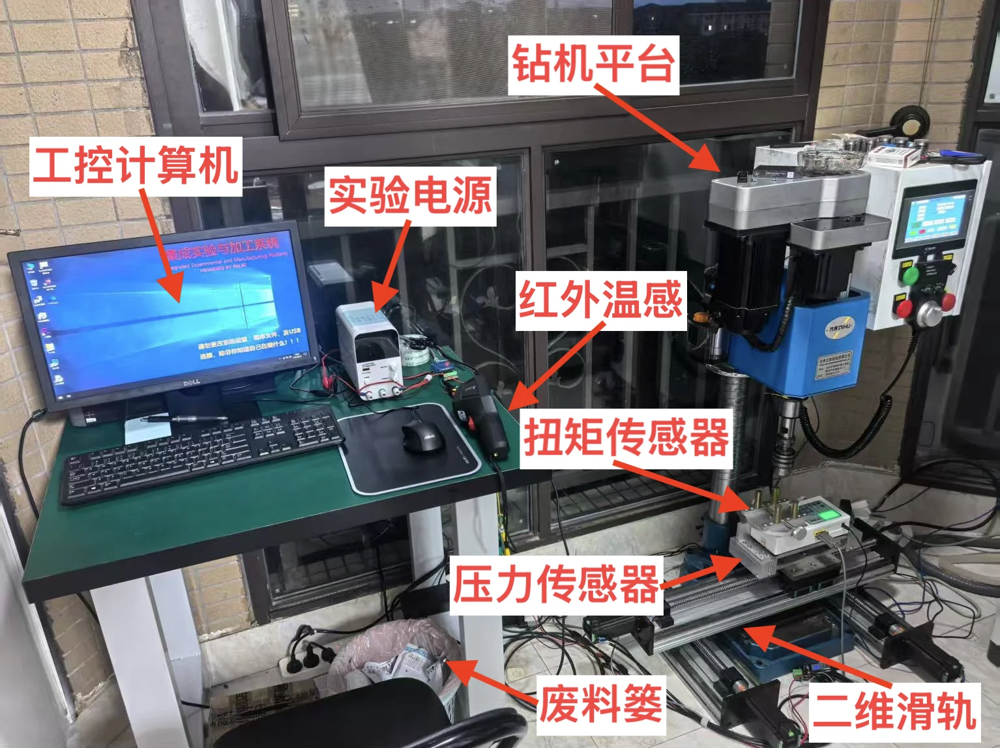
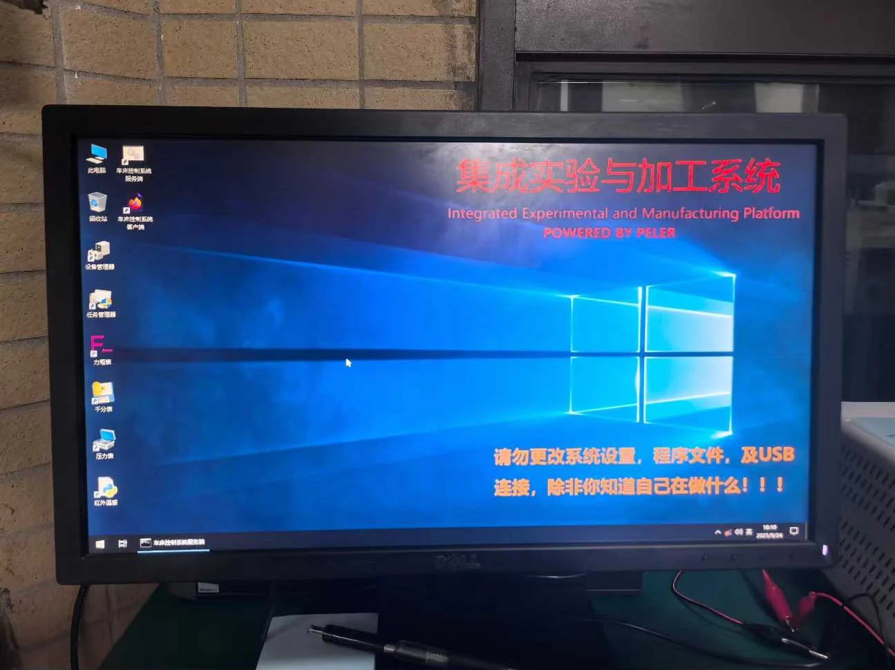
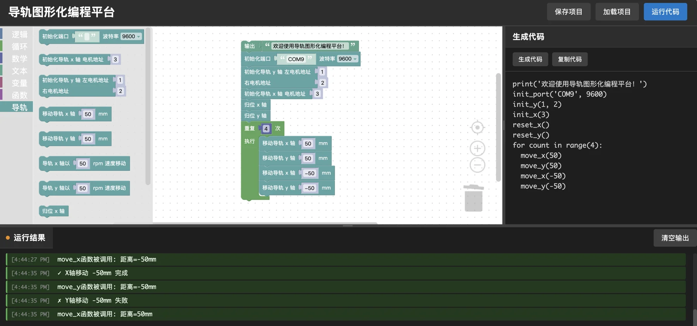
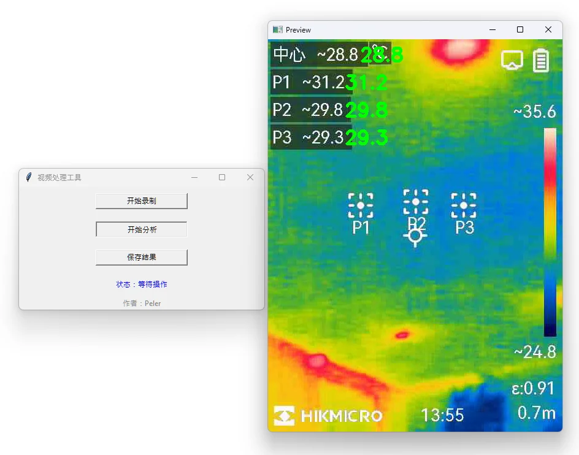
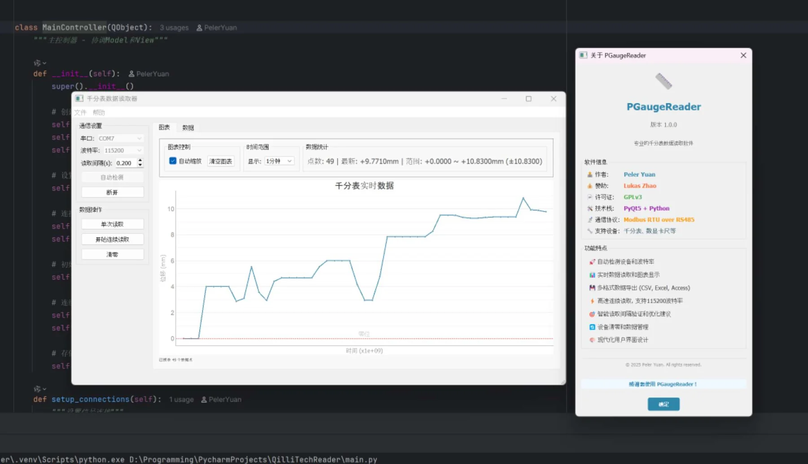
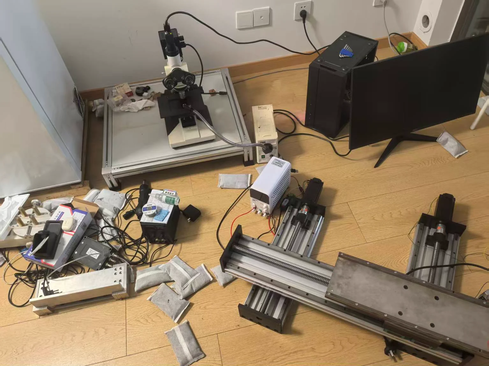
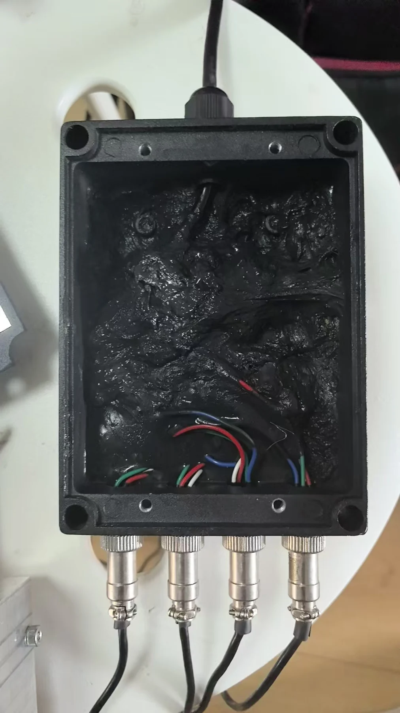
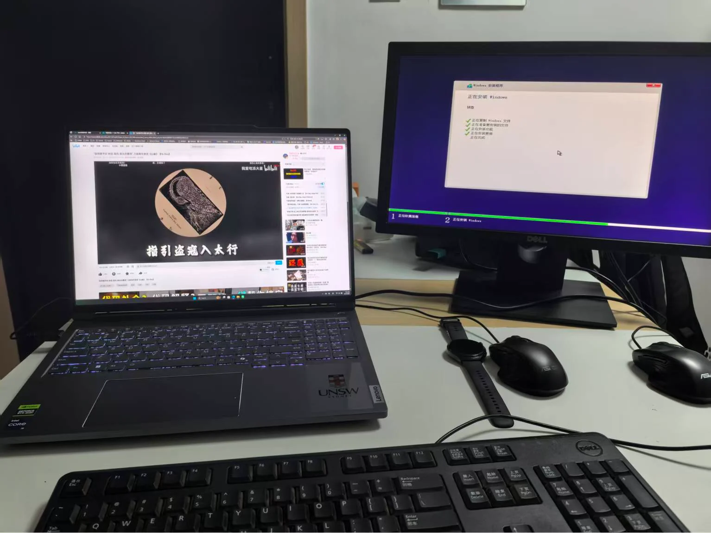
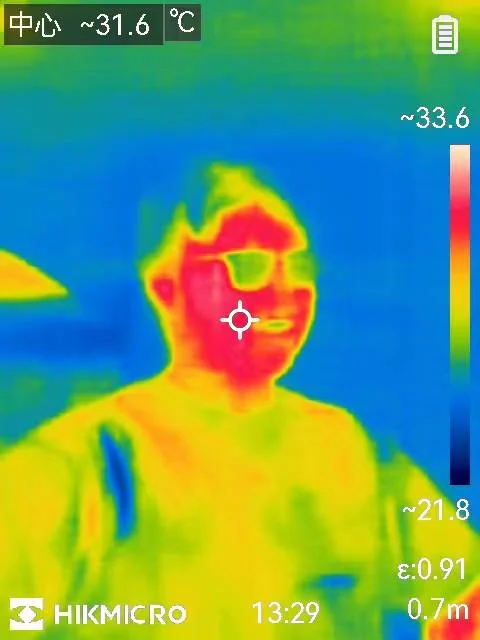

# Physical Experiment System Overview

## At a Glance

| | |
|---|---|
| **Purpose** | Drill wood samples while recording the pressure, torque, temperature and displacement produced during machining |
| **Client** | Dr. Lukas's doctoral research on how wood-processing methods affect structural stability |
| **Components** | Industrial control computer, drilling platform, 2D slideway, pressure sensors, torque sensor, infrared thermal imager, dial indicator |
| **Status** | In service for over 8 months, supporting over 100 sample-processing and data-recording sessions |
| **Developer** | Peler, who carried out the system design, software development, installation, commissioning and maintenance, apart from some hardware procurement |

## Design Goals

- **Integration**: every component connects to one industrial control computer, so sample processing and data acquisition happen at a single workstation.
- **Ease of use**: every function has a graphical interface (including the graphical slideway programming system), backed by user manuals, to keep the learning curve low.
- **Low cost**: most components are second-hand. Missing documentation made development harder, but the savings were significant.
- **Maintainability**: modules are clearly labelled, and wiring and common issues are recorded in the development notes so technicians can inspect and repair the system quickly.
- **Stability**: the system has to run for long periods in a high-vibration, high-dust environment; see [Project Outcomes](#project-outcomes) for how it has held up.

## Background

Dr. Lukas's doctoral research studies how different wood-processing methods affect the overall structural stability of wood. That calls for a system that combines wood processing with data recording. The drilling platform and its 2D slideway control the drilling position precisely, while pressure and torque sensors mounted on the slideway's stage record data in real time for later mathematical analysis. The infrared thermal imager and the dial indicator add thermal-image analysis and real-time displacement recording when needed.

Because the experiments are unusual, no off-the-shelf system exists. The budget was also limited, so most equipment is second-hand, with missing documentation and no technical support. The central challenge was to bring every component up, integrate them into one industrial control system, make the drilling platform and the 2D slideway work together, and collect all sensor data in real time.

## System Architecture

<Diagram name="rig" caption="System architecture. Dashed lines carry data and signals; dotted lines carry power." />

<figure class="w-70">
  
  <figcaption>The assembled system (click to enlarge; labels are in Chinese). Taken during development and commissioning, so clutter is still on the drilling platform. The dial indicator is not shown because it is used in a different setup.</figcaption>
</figure>

## Requirements

| Subsystem | Starting situation | Requirement |
|---|---|---|
| **Industrial control computer** | Must run several experiment programs at once; thermal-image analysis is CPU-intensive | A stable Windows 10 distribution; at least 4 GB of RAM; a reasonably modern CPU |
| **Drilling platform** | Has its own built-in control system, but the machining data of each run must be measured and calculated separately | Adjust the drill-bit height to leave enough clearance for the 2D slideway |
| **2D slideway** | Several motors are driven in time-division through USB-to-serial converters; the structure must survive transport and long periods of vibration and dust from the drilling platform | Synchronised, precise motor movement exposed as an API; stable wiring and structure; a graphical programming interface that non-technical users can pick up quickly |
| **Pressure sensors** | Four sensors with the manufacturer's acquisition unit; the device model does not match the hardware, the wiring was disorganised, and no documentation or support was available | Ready-to-use host software that transmits, displays and records data in real time |
| **Torque sensor** | The manufacturer supplies host software but support is hard to reach; needs its own 220 V supply and otherwise connects to the computer over USB | Ready-to-use host software that transmits, displays and records data in real time |
| **Infrared thermal imager** | Has a built-in LAN transfer function, but the second-hand unit's administrator password was lost, so it cannot be used | Transfer over a USB-C cable long enough for the actual layout; host software that transmits and records thermal images in real time and analyses temperatures at specific points |
| **Dial indicator** | The manufacturer provides clear documentation but charges for its software, which the budget did not allow; needs an extra USB-to-serial converter between the decoder and the indicator | Custom host software that transmits and displays data in real time, reads at high frequency, and records timestamps so the data can be merged later |

## Subsystems

This section covers only the software and wiring that Peler developed independently. Vendor-supplied software is not shown.

### Industrial Control Computer System

<figure class="w-70">
  
  <figcaption>Desktop of the industrial control computer</figcaption>
</figure>

All host software and data-analysis tools are installed, with shortcuts to common system-management utilities. The operating system is Windows 10 Enterprise 2021 LTSC, tuned with scripts and with system updates and similar services switched off so that the environment stays stable and unchanged. See [Industrial Control Computer System](./industrial-computer).

### 2D Slideway Modular Programming Control System

<figure class="w-70">
  
  <figcaption>The slideway programming interface</figcaption>
</figure>

A block-based programming system that needs no programming background. It supports console output, loops, conditionals, variables and functions, plus slideway initialisation, homing, precise movement and speed-controlled movement. See [2D Slideway Modular Programming Control System](./slideway).

### Infrared Thermal Image Transfer and Analysis System

<figure class="w-50">
  
  <figcaption>The thermal-image software</figcaption>
</figure>

Streams and records thermal video from the device in real time, then analyses it frame by frame to read the temperature at the centre point and at three user-defined points, and saves both the video and the results. See [Infrared Thermal Image Transfer and Analysis System](./thermal-imaging).

### Dial Indicator Data Acquisition and Recording System

<figure class="w-70">
  
  <figcaption>The dial indicator software</figcaption>
</figure>

Detects and matches the baud rate automatically, reads data continuously and plots it live, and exports the results. See [Dial Indicator Data Acquisition and Recording System](./dial-indicator).

## Design and Implementation Challenges

| Area | Challenge |
|---|---|
| **Design** | Many components in a limited space, which must still be stable, safe and easy to use |
| **Engineering** | The tight space made it hard to move and assemble large items such as the slideway, drilling platform and workbench; the drilling platform needs a dedicated high-power outlet and extra grounding |
| **Requirements** | Keeping the system compact yet maintainable, and able to run for long periods in a high-vibration, high-dust environment |
| **Maintenance** | The pressure sensors and the slideway have complex wiring, so cables and connections must be labelled for later repairs |
| **Software** | Keeping the system and each program stable and compatible, debugging each device, and pre-configuring fixed parameters to keep the learning curve low |

## Project Outcomes

The system has been formally deployed in the experimental environment for over 8 months and has supported over 100 sample-processing and data-recording sessions. The most recent inspection, after three months of continuous use, found no faults or latent hazards: all components were working properly and had coped with the high-vibration, high-dust environment.

## Personal Contributions

| Area | Scope |
|---|---|
| **Hardware procurement** | Industrial control computer system, workbench, laboratory power supply, cables and the required USB-to-serial converters |
| **Software development** | The industrial control computer system as a whole; the 2D slideway programming control system; the thermal-image transfer and analysis system; the dial indicator acquisition and recording system |
| **Installation and testing** | Workbench, industrial control computer system, torque sensor, pressure sensors, 2D slideway, infrared thermal imager, dial indicator |
| **Other** | System layout design and installation; periodic inspection and maintenance; development documentation and user manuals |

Hank helped with the wiring and with moving the system, which saved a great deal of time and effort.

## Development Gallery

  <figure>
    
    <figcaption>Components before assembly</figcaption>
  </figure>
  <figure>
    
    <figcaption>Pressure-sensor acquisition unit: tangled wiring and no documentation</figcaption>
  </figure>
  <figure>
    
    <figcaption>Installing the operating system</figcaption>
  </figure>
  <figure>
    
    <figcaption>A test frame from the infrared thermal imager</figcaption>
  </figure>

