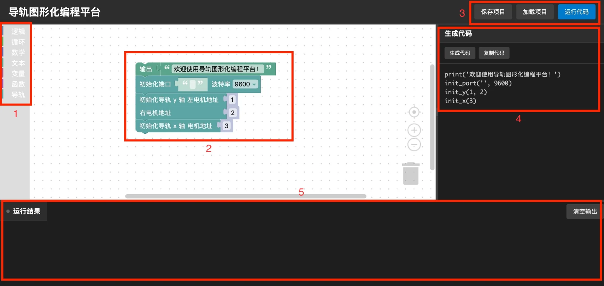

# 2D Slideway Modular Programming Control System

This project is part of the [Physical Experiment System](./experiment-system).

## Overview

A modular, web-based programming system that makes slideway programming far easier for ordinary users, so they can initialise, home, move precisely and move at a set speed without writing low-level code.

<figure class="w-100">
  
  <figcaption>The slideway programming interface (click to enlarge)</figcaption>
</figure>

The system is a complete graphical programming environment: a block-programming workspace, a generated-code panel (for advanced users to debug and inspect) and a results panel. It monitors slideway state in real time, supports debugging, and lets projects be saved and imported.

## Background

The physical experiment system machines wood on a drilling platform and needs operations such as drilling at precise spacings, so a 2D slideway that can move precisely is essential. The difficulty was giving users with no technical background an interface they could pick up. This project was built to meet that need.

## Requirements

**Functional**

- Precise slideway movement control
- Full block-programming functionality
- Code translation and display
- Real-time system status
- Project export and import

**Non-functional**

- Interference resistance when communicating with the motor controller
- Limit protection for the slideway motors
- Long-term operation in a high-vibration, high-dust environment

## Development Workflow

<Diagram name="flow-slideway" caption="Development workflow of the slideway control system" wide />

## Technology

| Layer | Technology |
|---|---|
| **Hardware control** | Python + pyserial for serial communication |
| **Web front end** | Vanilla JavaScript + Blockly for the block-programming interface |
| **Web back end** | Python + Flask, serving the web page and the hardware-control API |

## Implementation Challenges

### Hardware

| Area | Challenge |
|---|---|
| **Development** | The second-hand motor controller's model was unclear and documentation was missing |
| **Engineering** | The slideway is heavy, which made wiring and installation hard |
| **Requirements** | High-bit-rate communication needed interference handling; the whole system had to be sturdy enough to survive transport and the continuous vibration and dust from the drilling platform |

### Software

| Layer | Challenge |
|---|---|
| **Hardware control** | Synchronising motor commands, calibrating motor coordinates, time-division motor control, handling serial packet loss, restarting after limit protection trips |
| **Web front end** | Designing the block-programming interface; custom block logic |
| **Back end** | Letting user programs call the motor-control API; real-time status monitoring |

## User Interface

<figure class="w-100">
  
  <figcaption>Interface regions (click to enlarge)</figcaption>
</figure>

1. **Block menu**: basic logic, loops, maths, string operations, variables, functions and slideway control.
2. **Block workspace**: drag blocks from the menu and arrange them to write a program.
3. **Menu bar**: project export and import, and the run button.
4. **Generated code**: live code generated from the block program, for advanced users to debug and inspect.
5. **Run results**: run messages and slideway state, returned in real time.

## Results

The system is deployed in the real experimental environment as part of the physical experiment system (for how long, see the [overview](./experiment-system#project-outcomes)). The most recent inspection confirmed that all functions were still working after three months in a high-vibration, high-dust environment. Users report that the block-programming interface is intuitive and concise and covers all functional requirements.

## Personal Contributions

This project was completed by Peler, apart from procuring the slideway.

| Area | Scope |
|---|---|
| **Hardware** | Wiring, reinforcing the slideway, adding USB-to-serial converters, debugging the motor controller |
| **Software** | Low-level motor-control API, block-programming front end, web back end |
| **Integration** | Finding documentation and debugging the motor controller, developing and testing the system, writing documentation |

Hank helped with the wiring and with moving the system, which saved a great deal of time and effort in hardware development.
